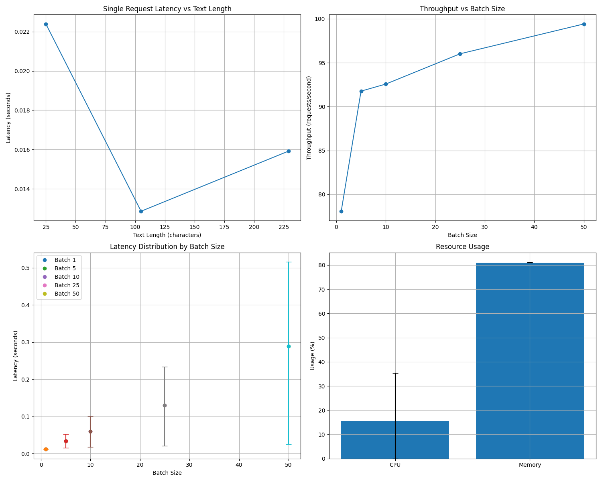

# Build the Docker image
docker build -t jina-embedding-v2 .

# Run the container
docker run -d --name jina-embeddings-v2 -p 8000:8000 jina-embedding-v2

# Test the health endpoint
curl http://localhost:8000/health

# Get embeddings for a sample text
curl -X POST "http://localhost:8000/embed" \
  -H "Content-Type: application/json" \
  -d '{"text": "This is a sample text to test Jina AI embeddings."}'

## Benchmarking

Testing Environment
Hardware: MacBook Pro M2, 16GB RAM
Model: SGPT-125M
Docker Configuration: Python 3.9, FastAPI
Testing Tool: Custom Python benchmarking script
Test Date: April 12, 2025

