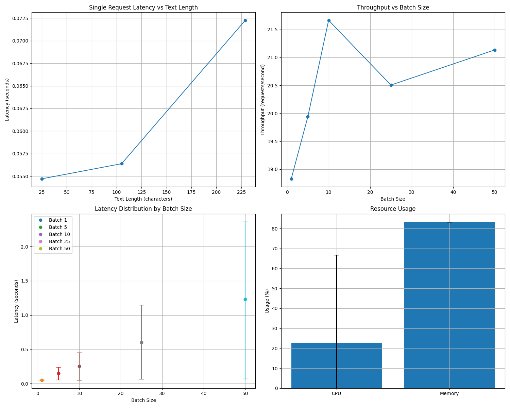

# SGPT Embedding Service

A FastAPI service that provides text embeddings using the SGPT (Sentence GPT) model .

## Overview

This service uses the SGPT-125M model(Muennighoff/SGPT-125M-weightedmean-nli-bitfit) to generate embeddings for text input. It exposes a simple REST API endpoint that accepts text and returns the corresponding embedding vector.

## Installation

1. Clone the repository
2. Run Docker:
```
# Build the Docker image
docker build -t sgpt-embedding-service .

# Run the container
docker run -d --name sgpt-embeddings -p 8000:8000 sgpt-embedding-service
```


CURL EXAMPLE

```
curl --location 'http://localhost:8000/embed' \
--header 'Content-Type: application/json' \
--data '{
    "text": "myvi av 2020"
}'
```


## Benchmarking

Testing Environment
Hardware: MacBook Pro M2, 16GB RAM
Model: SGPT-125M
Docker Configuration: Python 3.9, FastAPI
Testing Tool: Custom Python benchmarking script
Test Date: April 12, 2025



